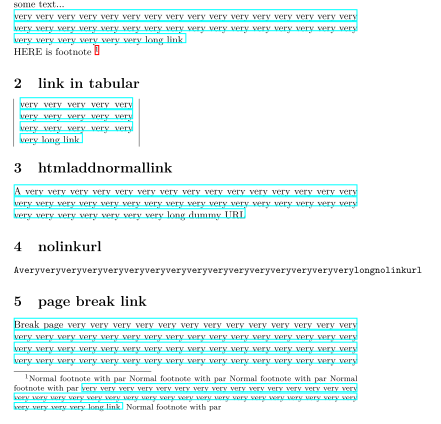

# dvibreaklinks
Automated Tex document links break using DVI->PS->PDF workflow.

# Usage
Load `dvibreaklinks` after hyperref and make sure you've added `breaklinks` option to hyperref.

```
\usepackage[breaklinks]{hyperref}
\usepackage{dvibreaklinks}
```

# Limitations 
It will work only with luatex engine because link insertion is based on `\localleftbox` and `\localrightbox`.

# Example


